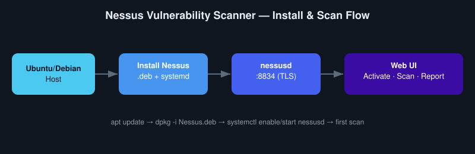

# 🔍 Nessus Vulnerability Scanner Guide

  

Welcome to the Nessus Automation and Installation Repository. This project provides everything needed to get started with **Tenable Nessus**, from basic installation on Ubuntu/Debian systems to API-based automation for scans, reports, and integrations.



---

## 📘 What Is This?

Nessus is one of the most trusted vulnerability scanners, used by professionals around the world to identify system weaknesses. This repository covers:

- ✅ Full Nessus installation instructions
- 📊 Scan configuration and reporting
- 🔐 Credential and policy management

---

## 📦 Requirements

- Ubuntu 18.04+ or Debian 10+
- Root or sudo access
- Internet access
- Open TCP port 8834 (for Web UI)

---

## 🚀 Installation Steps

### 1. Update System

```bash
sudo apt update && sudo apt upgrade -y
```

### 2. Download Nessus Installer

```bash
wget -O Nessus.deb https://www.tenable.com/downloads/api/v1/public/pages/nessus/downloads/nessus-10.6.1-debian10_amd64.deb
```

### 3. Install the .deb Package

```bash
sudo dpkg -i Nessus.deb
sudo apt --fix-broken install -y
```

### 4. Enable and Start Nessus

```bash
sudo systemctl enable nessusd.service
sudo systemctl start nessusd.service
```

### 5. Check Status

```bash
sudo systemctl status nessusd
```

### 6. Open the Web UI

- https://localhost:8834  
- Or: https://<your-server-ip>:8834

> Accept SSL warning for self-signed cert

---

### 7. Activate Nessus

Choose between:
- **Nessus Essentials** (free)  
- **Nessus Professional**

Get a free key: https://www.tenable.com/products/nessus/nessus-essentials

---

### 8. Create Admin User

Set your username and password. Nessus will download plugins, which may take 5–10 minutes.

---

### 9. First Scan

- Log into the Web UI
- Click **New Scan**
- Choose a scan template
- Set target IPs
- Launch and analyze

---

## 💡 Use Cases

- Security team automation
- DevSecOps integration
- CI/CD vulnerability checks
- Regular compliance scans (e.g., NIST, CMMC)

---

## 🎯 What I Learned / Skills Demonstrated

- **Vulnerability management fundamentals** — how a commercial-grade scanner like Nessus authenticates, schedules, and reports on findings, and where it fits in a broader vuln-management lifecycle.
- **Linux service administration** — installing a `.deb` package with dependency resolution (`apt --fix-broken install`), managing it as a `systemd` service, and validating service health.
- **TLS basics in practice** — working with self-signed certs on first run and understanding why the browser warning appears (and when that's acceptable vs. a red flag).
- **Documentation as a deliverable** — turning a one-time manual install into a guide someone else (or future-me) can follow without re-deriving each step.

**Problem solved:** removed the guesswork from a first-time Nessus install — a clean, repeatable path from a bare Ubuntu/Debian host to a working scanner ready for its first authenticated scan.

---

## 📚 Resources

- [Tenable Downloads](https://www.tenable.com/downloads/nessus)
- [Nessus Essentials Key](https://www.tenable.com/products/nessus/nessus-essentials)
- [Nessus Documentation](https://docs.tenable.com/nessus.htm)
- [Tenable Developer Portal](https://developer.tenable.com/)

---

## 📄 License

MIT License. See [LICENSE](./MIT%20License.txt) for more info.

---

🚀 Secure your environment with Nessus — the gold standard in vulnerability scanning.
